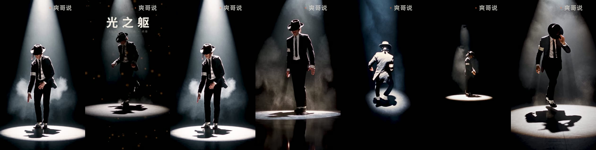
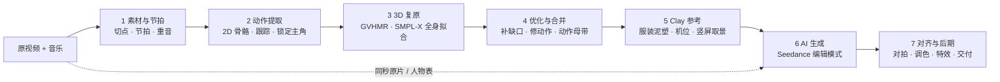

# 原视频动作复刻 → 多角度 AI 视频 SOP

**人是真的，镜头和世界是算的。** 从一段表演原视频里把人的动作逐帧算成 3D，渲染成 clay（泥塑）动作参考，再让 AI 只负责「画面长什么样」——动作、机位、节拍全由程序控制。每个镜头都卡在音乐上，能拍出现实里拍不到的机位，不靠反复抽卡。

**范例：《光之躯》竖版**（1995 年 MTV VMA《Dangerous》现场的动作复刻）

| 时长 | 规格 | AI 镜头 | 生成花费 | 动作对拍 |
|---|---|---|---|---|
| 96 秒 | 1080×1920 · 24 fps · −12 LUFS | 11 个（前 32 秒 1080p，其余 720p 超分） | ¥419（含 2 个重做） | 每个镜头逐帧对齐，校正前漂移最多 ±10 帧 |

原片参考 · clay 动作参考 · AI 成片（同一时刻）：

同一个环绕镜头，上排 clay，下排 AI（动作和机位逐帧继承）：

## 流程总览

## 七步

| 步 | 做什么 | 关键工具 | 产物 | 文档 |
|---|---|---|---|---|
| 1 | 选片、切点、音乐节拍与重音 | ffmpeg scdet、demucs、librosa | 切点表、节拍、重音曲线 | [01](docs/01-素材与节拍.md) |
| 2 | 每帧 2D 骨骼、跟踪、只锁定主角 | YOLO11x-pose + ByteTrack、RTMW 133 点、SAM 2.1 | 主角逐帧 2D 关键点、身份表 | [02](docs/02-动作提取与身份锁定.md) |
| 3 | 单目 3D 人体，逐帧全身拟合 | GVHMR、SMPL-X（SMPLify-X 式拟合） | 帧级准确的 3D 动作 | [03](docs/03-3D动作复原.md) |
| 4 | 卡点验收、补缺口、局部修动作、合并成一条 | 自写拟合 / IK / 重定时 | 动作母带（全片连续） | [04](docs/04-动作优化与合并.md) |
| 5 | 穿衣泥塑 + 设计机位 → clay 参考视频 | moderngl 光栅化、关键帧机位 | 每镜头 clay.mp4 + 机位数据 | [05](docs/05-Clay动作参考与机位.md) |
| 6 | 编辑模式生成真人质感的多角度镜头 | Seedance 2.5（火山方舟） | 每镜头 AI 视频 | [06](docs/06-多角度AI视频生成.md) |
| 7 | 动作对拍、统一调色、超分、特效、字、响度 | YOLO 姿态 + DTW、Real-ESRGAN、GPU 合成 | 成片 | [07](docs/07-对齐后期交付.md) |

验收标准 → [08](docs/08-验收标准.md) · 成本与工时 → [09](docs/09-成本与工时.md) · 常见坑 → [10](docs/10-常见坑.md) · 授权与合规 → [11](docs/11-授权与合规.md)

模板：[编辑模式提示词](templates/prompt_edit_mode.md) · [镜头卡](templates/shot.yaml) · [开工清单](templates/开工清单.md)

## 你需要准备

- **显卡**：16 GB 显存级（实测 RTX 4080 SUPER）。GVHMR 峰值 5.8 GB；GPU 合成约 45 fps。
- **软件**：Python 3.12 + PyTorch CUDA、ultralytics、rtmlib + onnxruntime-gpu、smplx、moderngl、scipy；GVHMR 单独一个 Python 3.10 环境；带 NVENC 的 ffmpeg。
- **账号**：火山引擎方舟（Seedance 2.5）；对象存储（参考视频要用签名 URL 提交）。
- **模型许可**：SMPL-X / SMPL 需在官网注册下载，默认仅限非商业用途（见 [11](docs/11-授权与合规.md)）。

## 核心原则

1. **动作不交给 AI**。AI「模仿」参考动作一定会走样；必须用编辑模式，把 clay 当作逐帧继承的底片。
2. **先算后生成**。机位、景别、节拍重音都在 3D 里定好，生成只负责外观。
3. **一次过 + 后期校正**。每镜头只生成一次；对拍、调色、瑕疵在后期解决。只有内容性错误（服装变色、整段黑场）才重做。
4. **测量代替感觉**。每一步都有可量化的验收（重投影误差、停点帧差、对拍偏移、响度）。
