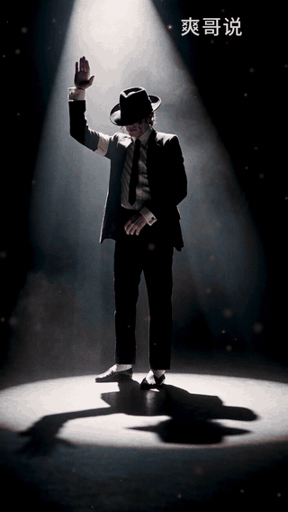
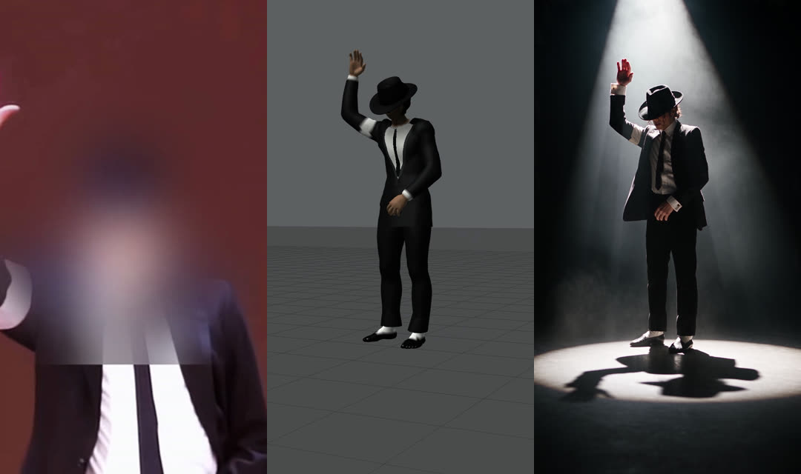
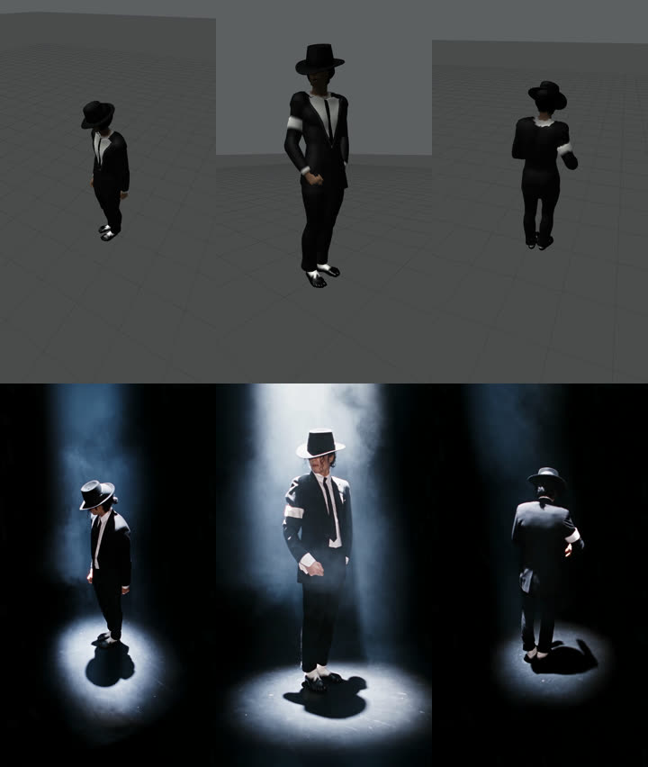
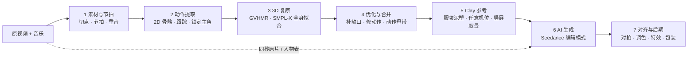

<div align="center">

# 一个原片 · 任意机位

### 原视频动作复刻 → 3D 动作 → Clay → 多角度 AI 视频

**统一动作，任意角度，任意世界。不是把原片画面换个皮。**

[](https://github.com/bitqs/video-to-motion-sop/stargazers)
[](LICENSE)
[](AGENTS.md)
[](docs/06-多角度AI视频生成.md)
[](docs/03-3D动作复原.md)
[](#关注作者)



*《光之躯》竖版 · 1995 年 MTV VMA《Dangerous》现场的动作复刻 · 96 秒 · 11 个 AI 镜头 · 生成花费 ¥419*

**⭐ 觉得有用就点个 Star —— 新的风格模板、镜头配方和参考脚本会先在这里更新。**

</div>

---

## 它和「把原片画面直接替换」有什么本质区别？

市面上的视频重绘 / 换风格，都是在**原片那一个机位**上逐帧改画面。这套工作流先把人的动作算成 3D：

| | 原片画面直接替换 | **本工作流** |
|---|---|---|
| 机位 | 只能是原片那一个角度 | **任意角度**：环绕、俯拍、贴地、背后、穿越机 |
| 动作 | 跟着原片像素走，换角度就没了 | **一份 3D 动作母带**，所有镜头、所有风格共用，动作完全统一 |
| 卡点 | 取决于原片怎么剪 | 机位和重音在 3D 里设计到帧，生成后逐帧对拍 |
| 改动作 | 改不了 | 在 3D 里改：加力度、改轨迹、对准重音 |
| 多风格 | 每种风格重画一遍原片 | **同一段动作 × N 个角度 × N 个世界**，按拍快切 |

<div align="center">

<br><sub>同一时刻：1995 原片参考 · clay 动作参考 · AI 成片</sub>
<br><br>

<br><sub>原片里没有的环绕机位：上排 clay，下排 AI，动作和机位逐帧继承</sub>
</div>

## 🤖 让你的 AI agent 来做

这个仓库是写给 agent 读的。把下面这段话丢给 Claude Code / Codex / Cursor：

```text
读 https://github.com/bitqs/video-to-motion-sop 的 AGENTS.md，
按里面的流程把 <你的视频> 做成 9:16 的多角度 AI 视频。
开工前先问我清单里的问题；先出 10 秒样片给我看，花钱前报价。
```

[AGENTS.md](AGENTS.md) 里有 agent 需要的全部东西：不变式、要问人的问题、数据格式、每一步的参数和验收门槛、Seedance 请求体、对拍算法、故障速查、估价公式。

## ✨ 能做什么

- 🎥 **原片没有的机位**：环绕、俯拍、贴地仰拍、背后、穿越机——动作还是原片的动作
- 🥁 **卡在音乐上**：重音落在设计好的帧，生成镜头漂移逐帧校正（校正前最多 ±10 帧）
- 🌍 **一份动作，N 个世界**：赛博朋克、水墨、月球、黑白胶片、云海、油画……按拍快切，动作不断
- ✋ **能改动作**：「下拍更有力、拍到腿上」——峰速 4.9 → 11.6 m/s，落在重音帧
- 📱 **竖屏原生**：全身自动落在抖音安全区，冷开场、揭秘段、片尾卡一套包装
- 🔊 **交付就是成片**：1080×1920，−12 LUFS，真峰值 ≤ −1 dBTP

## 流程总览



| 步 | 做什么 | 关键工具 | 产物 | 文档 |
|---|---|---|---|---|
| 1 | 选片、切点、音乐节拍与重音 | ffmpeg scdet、demucs、librosa | 切点、节拍、重音曲线 | [01](docs/01-素材与节拍.md) |
| 2 | 每帧 2D 骨骼、跟踪、只锁定主角 | YOLO11x-pose + ByteTrack、RTMW 133 点、SAM 2.1 | 主角逐帧 2D、身份表 | [02](docs/02-动作提取与身份锁定.md) |
| 3 | 单目 3D 人体、逐帧全身拟合 | GVHMR、SMPL-X | 帧级准确的 3D 动作 | [03](docs/03-3D动作复原.md) |
| 4 | 卡点验收、补缺口、修动作、合并 | 拟合 / IK / 重定时 | 动作母带 | [04](docs/04-动作优化与合并.md) |
| 5 | 穿衣泥塑 + 机位 → clay 参考 | moderngl、关键帧机位、安全区拟合 | clay.mp4 + 机位数据 | [05](docs/05-Clay动作参考与机位.md) |
| 6 | 编辑模式生成真人质感 / 任意风格 | Seedance 2.5 | 每镜头 AI 视频 | [06](docs/06-多角度AI视频生成.md) |
| 7 | 对拍、统一调色、超分、特效、包装 | 姿态 DTW、Real-ESRGAN、GPU 合成 | 成片 | [07](docs/07-对齐后期交付.md) |

验收标准 [08](docs/08-验收标准.md) · 成本与工时 [09](docs/09-成本与工时.md) · 常见坑 [10](docs/10-常见坑.md) · 授权与合规 [11](docs/11-授权与合规.md) · 模板：[提示词](templates/prompt_edit_mode.md) · [镜头卡](templates/shot.yaml) · [开工清单](templates/开工清单.md)

## 📊 范例实测

| | 竖版（本次） | 横版全片 |
|---|---|---|
| 时长 | 96 秒（包装版 105 秒） | 5 分 18 秒 |
| AI 镜头 | 11 个（前 32 秒 1080p） | 31 个 |
| 生成花费 | ¥419 | 约 ¥1,180（含全部试片） |
| 动作精度 | 手部重投影 1.96 px · 重音停点 ≤ 1 帧 78% | 同一套母带 |
| 周期 | 定稿流程约 1.5 小时 | 3 天 |

## 你需要准备

- **显卡**：16 GB 显存级（实测 RTX 4080 SUPER）
- **软件**：Python 3.12 + PyTorch CUDA、ultralytics、rtmlib、smplx、moderngl；GVHMR 单独一个 3.10 环境；带 NVENC 的 ffmpeg
- **账号**：火山引擎方舟（Seedance 2.5）+ 对象存储
- **许可**：SMPL-X 需注册下载，默认非商业（见 [11](docs/11-授权与合规.md)）

## ❓ FAQ

**要会编程吗？** 不需要你亲手写——把仓库交给 AI agent，它按 [AGENTS.md](AGENTS.md) 做；你负责回答它的问题、看样片、拍板。

**花多少钱？** 生成按秒计费：720p 约 ¥2.7/秒，1080p 约 ¥6.1/秒（两段视频参考）。一支 90 秒竖版约 ¥400。被平台拒绝不扣费。

**能换成别的人、别的舞吗？** 能。任何有清晰全身画面的表演视频都行：舞蹈、武术、体育动作。

**为什么不直接让 AI「参考」原视频生成？** 参考模式只会模仿，动作走样、卡不上拍。必须用编辑模式把 clay 当底片逐帧继承。

**可以商用吗？** 本仓库文档按 CC BY 4.0 开放。流程里用到的模型和你的素材各有许可，商用前看 [11](docs/11-授权与合规.md)。

## 🗺️ Roadmap

- [x] 七步 SOP、验收标准、估价、故障速查
- [x] AGENTS.md（agent 执行手册）
- [ ] 参考实现脚本（去掉本地路径后发布）
- [ ] 一键 `run_all`：断点续跑的全流程
- [ ] 风格模板库：每种世界一段经过验证的提示词
- [ ] 多人群舞的统一动作
- [ ] 英文版

## 🙌 参与

- 用这套流程做出了作品？提 PR 把它放进 Showcase（附原片来源和授权说明）。
- 踩到新坑、有更好的参数？开 Issue。

## 关注作者

抖音 **「爽哥说」**——《足够震撼》《溢出》《光之躯》三部曲作者。

## Star History

[](https://star-history.com/#bitqs/video-to-motion-sop&Date)

## 引用 · 许可

转载、改编请署名「爽哥说」并附本仓库链接（[CC BY 4.0](LICENSE)）。

```bibtex
@misc{shuanggeshuo2026videotomotion,
  title  = {一个原片 · 任意机位：原视频动作复刻到多角度 AI 视频的工作流},
  author = {爽哥说},
  year   = {2026},
  url    = {https://github.com/bitqs/video-to-motion-sop}
}
```
